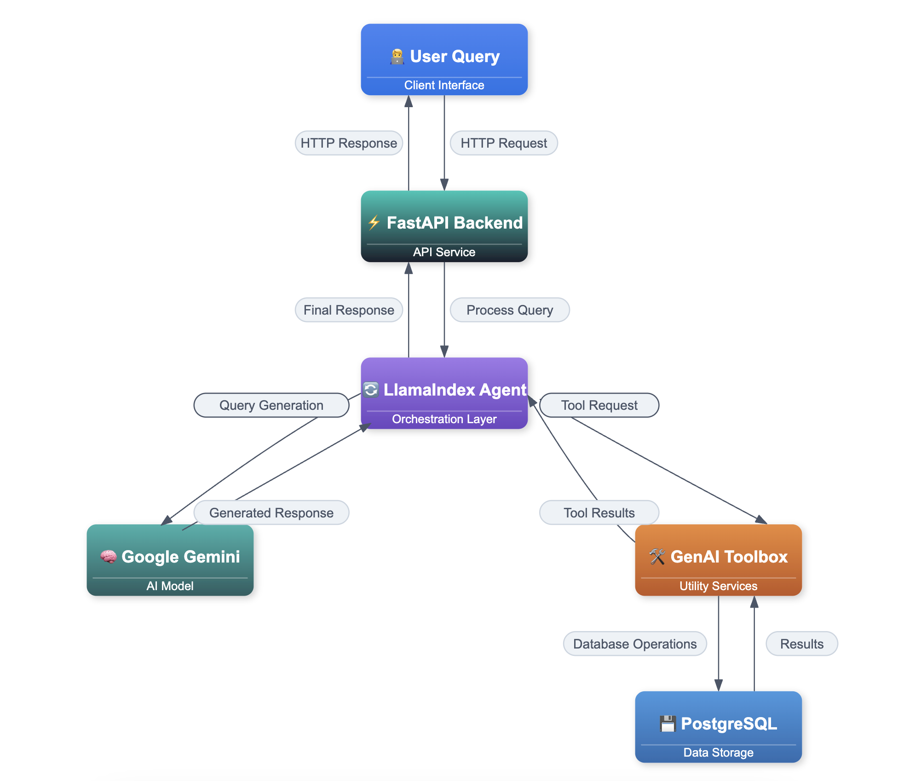
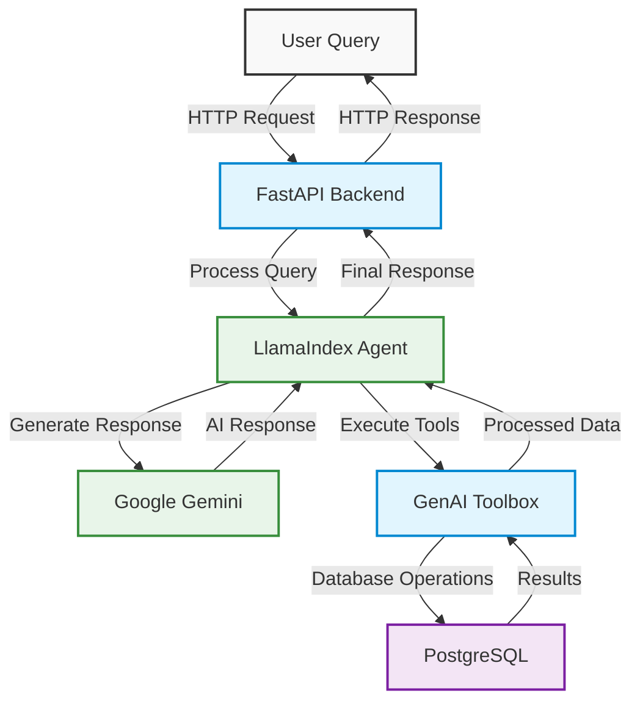

# DVD Rental Assistant with [Google Gemini](https://ai.google.dev/gemini-api) + [GenAI Toolbox](https://googleapis.github.io/genai-toolbox/getting-started/introduction/) + [LlamaIndex](https://docs.llamaindex.ai/en/stable/api_reference/agent/workflow/#llama_index.core.agent.workflow.AgentWorkflow)

[](https://www.python.org/downloads/)
[](https://fastapi.tiangolo.com/)
[](https://streamlit.io/)
[](https://www.postgresql.org/)
[](LICENSE)

A modern DVD rental assistant powered by Google's Gemini AI, built with FastAPI and Streamlit. This project demonstrates the integration of Google's latest AI technology with GenAI Toolbox and LlamaIndex to create an intelligent DVD rental management system.

## 📚 Table of Contents

- [Request Flow](#request-flow)
- [Features](#features)
- [Architecture](#architecture)
  - [Core Technologies](#core-technologies)
  - [Technology Stack Details](#technology-stack-details)
  - [System Architecture](#system-architecture)
- [Implementation Details](#implementation-details)
  - [GenAI Toolbox Integration](#genai-toolbox-integration)
  - [LlamaIndex AgentWorkflow Setup](#llamaindex-agentworkflow-setup)
- [Getting Started](#getting-started)
  - [Prerequisites](#prerequisites)
  - [Installation Steps](#installation-steps)
- [Project Structure](#project-structure)
- [API Documentation](#api-documentation)
  - [Endpoints](#endpoints)
- [Author](#author)
- [License](#license)

## Request Flow

The DVD Rental Assistant follows a streamlined request flow that combines the power of Google Gemini, LlamaIndex, and GenAI Toolbox to process user queries and provide intelligent responses.



## Features

- Natural language understanding for DVD rental queries
- Real-time database operations through GenAI Toolbox
- Intelligent conversation flow with LlamaIndex
- Context-aware responses with Google Gemini
- Structured data presentation with emojis
- Smart search capabilities across film database

## Architecture

### Core Technologies

| Layer        | Technologies                                                                 | Description                                                                 |
|--------------|------------------------------------------------------------------------------|-----------------------------------------------------------------------------|
| **AI/ML**    | - Google Gemini 1.5 Pro<br>- LlamaIndex AgentWorkflow<br>- GenAI Toolbox<br>- NLP | LLM-powered conversational AI with structured agent workflow and tool calling |
| **Backend**  | - FastAPI (Python 3.9+)<br>- PostgreSQL<br>- GenAI Toolbox Server<br>- WebSocket | High-performance, async backend with structured API and database connectivity |
| **Frontend** | - Streamlit<br>- Real-time Chat UI<br>- Responsive Components<br>- Interactive Visuals | User-friendly web interface with real-time interaction and modern UX          |

### Technology Stack Details

| Technology                  | Purpose                 | Key Features                                                                                              | Usage                                                        |
|----------------------------|-------------------------|-----------------------------------------------------------------------------------------------------------|--------------------------------------------------------------|
| **Google Gemini**          | Core AI Engine          | - Natural language understanding<br>- Context-aware multi-turn responses<br>- Structured data generation | Drives conversational intelligence and user intent detection |
| **GenAI Toolbox**          | Database Operations     | - SQL query execution<br>- Tool abstraction<br>- Secure DB access<br>- Error handling                    | Enables seamless AI-to-PostgreSQL communication              |
| **LlamaIndex AgentWorkflow** | Conversation Orchestration | - Tool selection logic<br>- Context tracking<br>- Modular response formatting                            | Manages structured flow between LLM and tools                |
| **FastAPI**                | API Backend             | - Async I/O<br>- Auto-generated Swagger docs<br>- Pydantic validation                                     | Hosts REST API endpoints and WebSocket connections           |
| **Streamlit**              | Frontend Interface      | - Real-time chat<br>- Emoji support<br>- Responsive layout<br>- State handling                           | Delivers dynamic and intuitive UI to users                   |
| **Pydantic**               | Data Validation Layer   | - Type enforcement<br>- JSON serialization<br>- Env parsing                                               | Ensures structured, safe request and response data handling  |

### System Architecture




## Implementation Details

### GenAI Toolbox Integration

```python
from toolbox_llamaindex import ToolboxClient

# Initialize toolbox client
client = ToolboxClient("http://127.0.0.1:5000")

# Load database tools
tools = client.load_toolset()
```

### LlamaIndex AgentWorkflow Setup

```python
from llama_index.core.agent import AgentWorkflow
from llama_index.core.tools import ToolMetadata
from llama_index.llms import GoogleGenAI

# Initialize the agent with tools and LLM
agent = AgentWorkflow.from_tools_or_functions(
    tools,
    llm=GoogleGenAI(
        model="gemini-1.5-pro",
        vertexai_config={
            "project": "vertex-ai-experminent",
            "location": "us-central1"
        }
    ),
    system_prompt=DVD_RENTAL_PROMPT
)
```

## Getting Started

### Prerequisites
- Python 3.9+
- PostgreSQL with Pagila database
- Google API key for Gemini
- GenAI Toolbox access

### Installation Steps

### 1. **Clone Repository**
   ```bash
   git clone https://github.com/arjunprabhulal/gemini-toolbox-dvd-rental-assistant.git
   cd gemini-toolbox-dvd-rental-assistant
   ```

### 2. **Environment Setup**
   ```bash
   python -m venv venv
   source venv/bin/activate  # On Windows: venv\Scripts\activate
   pip install -r requirements.txt
   ```

### 3. **Configuration**
   ```bash
   cp .env.example .env
   # Edit .env with your credentials:
   # GOOGLE_API_KEY=your_gemini_api_key
   # TOOLBOX_URL=http://127.0.0.1:5000
   ```

### 4. **GenAI Toolbox Setup**
   ```bash
   curl -L https://github.com/google/generative-ai-toolbox/releases/latest/download/toolbox-darwin-amd64 -o toolbox
   chmod +x toolbox
   ./toolbox --version
   ```

### 5. **Database Setup**

This project uses the [Pagila](https://github.com/devrimgunduz/pagila) database — an example schema designed for PostgreSQL, inspired by the Sakila schema for MySQL.

**Special thanks to [devrimgunduz/pagila](https://github.com/devrimgunduz/pagila)** for providing the schema and sample data used in this project.

   ```bash
   # Step 1: Create and load database
   psql -U postgres
   CREATE DATABASE toolbox_db;
   \c toolbox_db
   \q

   # Step 2: Download Pagila schema and data
   mkdir -p database/pagila
   cd database/pagila
   curl -O https://raw.githubusercontent.com/devrimgunduz/pagila/master/pagila-schema.sql
   curl -O https://raw.githubusercontent.com/devrimgunduz/pagila/master/pagila-data.sql

   # Step 3: Load Pagila into the toolbox_db
   psql -U postgres -d toolbox_db -f pagila-schema.sql
   psql -U postgres -d toolbox_db -f pagila-data.sql
   ```

### 6. **Start Services**
   ```bash
   # Start GenAI Toolbox
   ./toolbox --tools_file "dvdrental_tools.yaml"

   # Start Backend
   uvicorn backend:app --reload

   # Start Frontend
   streamlit run streamlit_app.py
   ```

### 7. **Access Application**
   ```
   Backend: http://localhost:8000
   Frontend: http://localhost:8501
   ```

## Project Structure
```
gemini-toolbox-dvd-rental-assistant/
├── database/
│   └── pagila/
│       ├── pagila-schema.sql    # Database schema
│       ├── pagila-data.sql      # Initial data
│       └── pagila-insert-data.sql # Additional data
├── backend.py                   # FastAPI backend
├── streamlit_app.py            # Streamlit frontend
├── prompts.py                  # System prompts
├── dvdrental_tools.yaml        # Database configuration
├── requirements.txt            # Dependencies
└── .env                        # Environment variables
```

## API Documentation

### Endpoints

| Endpoint | Method | Description |
|----------|---------|-------------|
| `/health` | GET | System health check |
| `/chat` | POST | Process user queries |
| `/reset-context/{user_id}` | POST | Reset user conversation context |

## License

This project is licensed under the MIT License. See the [LICENSE](./LICENSE) file for details.

## Author
For more articles on AI/ML and Generative AI, follow me on [Medium](https://medium.com/@arjun-prabhulal)


