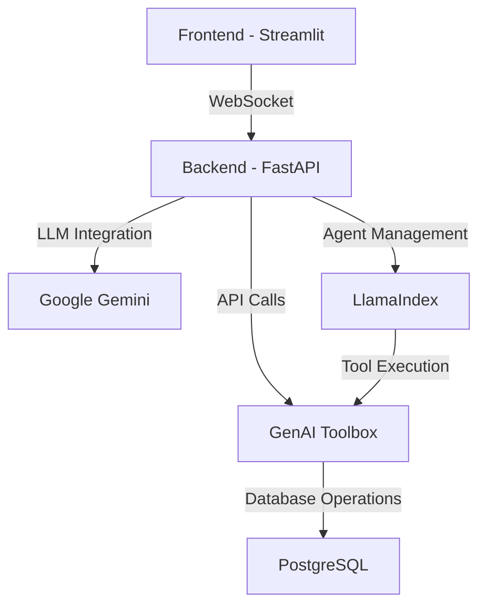
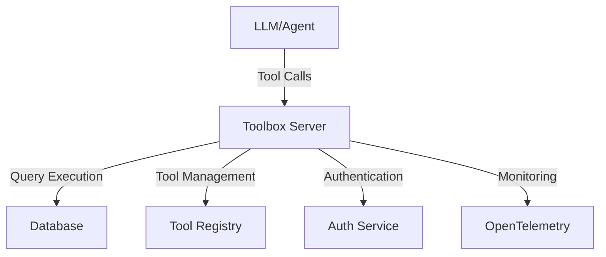
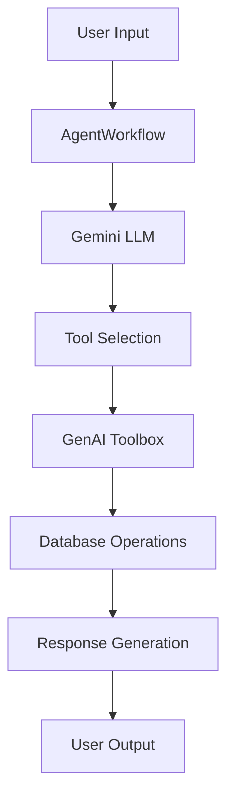

# DVD Rental Assistant with Google Gemini + GenAI Toolbox + LlamaIndex

A modern DVD rental assistant powered by Google's Gemini AI, built with FastAPI and Streamlit.

## Technical Stack

### Core Technologies
1. **AI/ML Layer**:
   - Google Gemini 1.5 Pro
   - LlamaIndex AgentWorkflow
   - GenAI Toolbox

2. **Backend Layer**:
   - FastAPI (Python 3.9+)
   - PostgreSQL Database
   - GenAI Toolbox Server

3. **Frontend Layer**:
   - Streamlit
   - WebSocket for real-time chat
   - Responsive UI components

4. **Infrastructure**:
   - Docker support
   - OpenTelemetry monitoring
   - Environment-based configuration

### Architecture Overview



### Key Technical Features

1. **AI Integration**:
   - Real-time natural language processing
   - Context-aware responses
   - Multi-turn conversation support
   - Dynamic tool selection

2. **Database Architecture**:
   - Connection pooling
   - Query optimization
   - Transaction management
   - Error handling

3. **API Design**:
   - RESTful endpoints
   - WebSocket support
   - Rate limiting
   - Error handling

4. **Security Features**:
   - API key authentication
   - Database encryption
   - Input validation
   - XSS protection

### Technical Implementation Details

1. **Backend Architecture**:
   ```python
   # FastAPI Application Structure
   app = FastAPI()
   
   # WebSocket Support
   @app.websocket("/ws/chat")
   async def websocket_endpoint(websocket: WebSocket):
       await websocket.accept()
       # Handle real-time chat
   
   # API Routes
   @app.post("/api/chat")
   async def chat_endpoint(message: ChatMessage):
       # Process chat messages
   ```

2. **Database Integration**:
   ```python
   # GenAI Toolbox Configuration
   tools = ToolboxClient("http://127.0.0.1:5000").load_toolset()
   
   # Database Operations
   @tool
   def search_films(title: str):
       # Optimized film search
   ```

3. **AI Processing Pipeline**:
   ```python
   # LlamaIndex Agent Setup
   agent = AgentWorkflow.from_tools_or_functions(
       tools,
       llm=GoogleGenAI(model="gemini-1.5-pro"),
       system_prompt=DVD_RENTAL_PROMPT
   )
   ```

4. **Frontend Components**:
   ```python
   # Streamlit UI Components
   st.title("DVD Rental Assistant")
   chat_container = st.container()
   input_container = st.container()
   ```

### Performance Considerations

1. **Database Optimization**:
   - Indexed queries
   - Connection pooling
   - Query caching
   - Batch operations

2. **AI Processing**:
   - Response streaming
   - Context management
   - Tool selection optimization
   - Error recovery

3. **API Performance**:
   - Rate limiting
   - Response compression
   - Caching headers
   - Load balancing

4. **Frontend Optimization**:
   - Lazy loading
   - Component caching
   - State management
   - Real-time updates

### Monitoring and Observability

1. **OpenTelemetry Integration**:
   - Request tracing
   - Performance metrics
   - Error tracking
   - Usage analytics

2. **Logging System**:
   - Structured logging
   - Log levels
   - Error tracking
   - Performance monitoring

3. **Health Checks**:
   - Database connectivity
   - API availability
   - AI service status
   - System resources

## Core Technologies

### 1. Google Gemini + GenAI Toolbox + LlamaIndex Integration
The application combines three powerful technologies:

#### Google Gemini AI
```python
from llama_index.llms.google_genai import GoogleGenAI
llm = GoogleGenAI(
    model="gemini-1.5-pro",
    vertexai_config={"project": "vertex-ai-experminent", "location": "us-central1"},
)
```
- Uses Gemini 1.5 Pro for advanced natural language understanding
- Provides context-aware responses with high accuracy
- Maintains conversation context across interactions
- Handles complex queries with sophisticated reasoning

#### GenAI Toolbox Integration
```python
from toolbox_llamaindex import ToolboxClient
client = ToolboxClient("http://127.0.0.1:5000")
tools = client.load_toolset()
```
- **Multi-Database Support**: Works with various databases including:
  - PostgreSQL (used in this demo)
  - MySQL
  - SQLite
  - MongoDB
  - And more...
- **Tool Management**: Dynamic loading of database tools
- **Performance**: Built-in connection pooling
- **Security**: Integrated authentication and access control
- **Observability**: OpenTelemetry support for monitoring

#### LlamaIndex AgentWorkflow
```python
from llama_index.core.agent.workflow import AgentWorkflow
from llama_index.core.workflow import Context

agent = AgentWorkflow.from_tools_or_functions(
    tools,
    llm=llm,
    system_prompt=DVD_RENTAL_PROMPT,
)
```
- **Conversation Flow**: Manages the entire conversation lifecycle
- **Tool Execution**: Coordinates between LLM and database tools
- **Context Management**: Maintains conversation state and history
- **Event Handling**: Processes various workflow events:
  - `AgentInput`: Handles user input
  - `AgentOutput`: Manages LLM responses
  - `ToolCall`: Executes database operations
  - `ToolCallResult`: Processes operation results

### 2. GenAI Toolbox Architecture

The application leverages the GenAI Toolbox architecture for efficient database operations:



#### Key Components:

1. **Toolbox Server**:
   - Central hub for tool execution
   - Manages database connections
   - Handles authentication
   - Provides monitoring capabilities

2. **Tool Registry**:
   - Stores tool definitions
   - Manages tool versions
   - Handles tool updates
   - Provides tool documentation

3. **Database Integration**:
   - Connection pooling
   - Query optimization
   - Error handling
   - Transaction management

4. **Security Layer**:
   - Authentication service
   - Access control
   - API key management
   - Request validation

5. **Monitoring**:
   - OpenTelemetry integration
   - Performance metrics
   - Error tracking
   - Usage analytics

### 3. Workflow Architecture



1. **Input Processing**:
   - User query received by AgentWorkflow
   - Context maintained across interactions
   - Input validated and processed

2. **LLM Processing**:
   - Gemini analyzes the query
   - Determines required tools
   - Generates response strategy

3. **Tool Execution**:
   - GenAI Toolbox loads appropriate tools
   - Executes database operations
   - Handles results and errors

4. **Response Generation**:
   - Results formatted with emojis
   - Follow-up questions generated
   - Context updated for next interaction

### 4. Smart Prompt System
The application uses a structured prompt system:

#### Full System Prompt
```python
DVD_RENTAL_PROMPT = '''
You're a DVD rental store assistant. You help customers find films, manage rentals, and provide recommendations.
[Comprehensive database schema and operations...]
'''
```

#### Simple Prompt
```python
SIMPLE_PROMPT = '''
You are a helpful DVD rental assistant. Your job is to:
1. Help customers find movies using search-films-by-title
2. Check if movies are available using get-film-availability
3. Show movie details with get-film-details
4. Format responses with emojis: 🎬 for titles, ⭐ for ratings, 💲 for prices
5. Always end with a friendly follow-up question
'''
```

### 4. Database Integration
The application uses GenAI Toolbox's multi-database support. In this demo, we're using PostgreSQL with the Pagila schema, but the system can work with any supported database:

#### Supported Databases
- **PostgreSQL**: Used in this demo with Pagila schema
- **MySQL**: Full support for MySQL databases
- **SQLite**: Lightweight database support
- **And more**: Extensible to other database types

#### Demo Database (PostgreSQL)
For demonstration purposes, we use PostgreSQL with the Pagila schema:

##### Core Tables
- **films**: Stores movie information (title, description, rental rates)
- **customers**: Manages customer details and accounts
- **rentals**: Tracks DVD rentals and returns
- **payments**: Records all payment transactions

##### Key Relationships
- Each rental links to a customer and a film
- Payments are connected to both rentals and customers
- Films can have multiple rentals over time
- Customers can have multiple active rentals

#### Database Configuration
```yaml
# dvdrental_tools.yaml
sources:
  my-pg-source:
    kind: postgres  # Can be mysql, sqlite, mongodb, etc.
    host: ${DB_HOST}
    port: ${DB_PORT}
    database: ${DB_NAME}
    user: ${DB_USER}
    password: ${DB_PASSWORD}
```

## Features

- 🎬 Smart Film Search: Find movies by title, category, or year
- 👥 Customer Management: Handle customer accounts and rental history
- 📦 Real-time Inventory: Check film availability and manage rentals
- 💬 Natural Conversations: Chat naturally with the AI assistant
- 🧠 Smart Memory: Maintains context across conversations

## Example Interactions

The assistant can handle various types of questions about movies:

### Movie Search
```
User: "Find me the movie Titanic"
Assistant: "🎬 Let me search for Titanic..."
[Shows movie details with emojis]
Would you like to know if it's available to rent?
```

### Availability Check
```
User: "Is The Matrix available?"
Assistant: "Let me check the availability of 🎬 The Matrix..."
[Shows availability status]
Would you like to see more details about this movie?
```

### Movie Details
```
User: "Tell me about Inception"
Assistant: "🎬 Here are the details for Inception..."
[Shows movie details with emojis]
Would you like to know the rental price?
```

## Setup

### Prerequisites

1. **Install Python 3.9 or higher**
2. **Install PostgreSQL**
3. **Get a Gemini API Key** from [Google AI Studio](https://aistudio.google.com/apikey)
4. **Install Project Dependencies**:
   ```bash
   pip install -r requirements.txt
   pip install llama-index-llms-google-genai
   ```

### Environment Setup

1. **Set up environment variables** in `.env`:
   ```
   GOOGLE_API_KEY=your_gemini_api_key_here
   DB_HOST=localhost
   DB_PORT=5432
   DB_NAME=toolbox_db
   DB_USER=toolbox_user
   DB_PASSWORD=your_database_password_here
   ```

2. **Set up GenAI Toolbox**:
   ```bash
   export VERSION=0.2.1
   curl -O https://storage.googleapis.com/genai-toolbox/v$VERSION/linux/amd64/toolbox
   chmod +x toolbox
   ./toolbox --tools_file "dvdrental_tools.yaml"
   ```

3. **Configure database**:
   ```yaml
   # dvdrental_tools.yaml
   sources:
     my-pg-source:
       kind: postgres
       host: ${DB_HOST}
       port: ${DB_PORT}
       database: ${DB_NAME}
       user: ${DB_USER}
       password: ${DB_PASSWORD}
   ```

### Database Setup

1. **Download Pagila Database**:
   ```bash
   # Create a directory for database files
   mkdir -p database/pagila
   cd database/pagila

   # Download Pagila database files
   curl -O https://raw.githubusercontent.com/devrimgunduz/pagila/master/pagila-schema.sql
   curl -O https://raw.githubusercontent.com/devrimgunduz/pagila/master/pagila-data.sql
   ```

2. **Create PostgreSQL Database**:
   ```bash
   # Connect to PostgreSQL
   psql -U postgres

   # Create database
   CREATE DATABASE toolbox_db;

   # Connect to the new database
   \c toolbox_db

   # Exit psql
   \q
   ```

3. **Load Pagila Schema and Data**:
   ```bash
   # Load schema
   psql -U postgres -d toolbox_db -f database/pagila/pagila-schema.sql

   # Load data
   psql -U postgres -d toolbox_db -f database/pagila/pagila-data.sql
   ```

4. **Verify Database Setup**:
   ```bash
   # Connect to database
   psql -U postgres -d toolbox_db

   # Check tables
   \dt

   # Check sample data
   SELECT COUNT(*) FROM film;
   SELECT COUNT(*) FROM customer;
   SELECT COUNT(*) FROM rental;

   # Exit psql
   \q
   ```

### Project Structure with Database Files
```
google-genai-toolbox/
├── database/
│   └── pagila/
│       ├── pagila-schema.sql    # Database schema
│       ├── pagila-data.sql      # Initial data
│       └── pagila-insert-data.sql # Additional data
├── backend.py                   # FastAPI backend
├── streamlit_app.py            # Streamlit frontend
├── prompts.py                  # System prompts
├── dvdrental_tools.yaml        # Database configuration
├── requirements.txt            # Dependencies
└── .env                        # Environment variables
```

### Database Configuration Details

1. **Environment Variables** (`.env`):
   ```
   DB_HOST=localhost
   DB_PORT=5432
   DB_NAME=toolbox_db
   DB_USER=postgres
   DB_PASSWORD=your_password_here
   ```

2. **Database Tools Configuration** (`dvdrental_tools.yaml`):
   ```yaml
   sources:
     my-pg-source:
       kind: postgres
       host: ${DB_HOST}
       port: ${DB_PORT}
       database: ${DB_NAME}
       user: ${DB_USER}
       password: ${DB_PASSWORD}
       ssl_mode: disable
       max_connections: 10
   ```

3. **Database Schema Overview**:
   - **films**: 1000+ movies with details
   - **customers**: Customer information
   - **rentals**: Rental records
   - **payments**: Payment transactions
   - **categories**: Movie categories
   - **actors**: Actor information
   - **film_actor**: Movie-actor relationships

4. **Sample Data Verification**:
   ```sql
   -- Check total records
   SELECT COUNT(*) FROM film;           -- Should be 1000+
   SELECT COUNT(*) FROM customer;       -- Should be 599
   SELECT COUNT(*) FROM rental;         -- Should be 16044
   SELECT COUNT(*) FROM payment;        -- Should be 32098

   -- Check sample film
   SELECT title, release_year, rental_rate 
   FROM film 
   WHERE title = 'ACADEMY DINOSAUR';
   ```

### Starting the Application

1. **Start GenAI Toolbox**:
   ```bash
   # Start toolbox server
   ./toolbox --tools_file "dvdrental_tools.yaml"
   ```

2. **Start Backend**:
   ```bash
   # In a new terminal
   python backend.py
   ```

3. **Start Frontend**:
   ```bash
   # In another terminal
   streamlit run streamlit_app.py
   ```

4. **Verify Setup**:
   - Backend API: http://localhost:8000/docs
   - Frontend UI: http://localhost:8501
   - Toolbox Server: http://localhost:5000

## Project Structure

- `backend.py`: FastAPI backend with LLM integration
- `streamlit_app.py`: Streamlit frontend with chat interface
- `prompts.py`: System prompts for the AI assistant
- `dvdrental_tools.yaml`: Database query definitions
- `requirements.txt`: Project dependencies
- `.env`: Environment variables

## API Documentation

Access the interactive API documentation at:
- http://localhost:8000/docs
- http://localhost:8000/redoc

## Author

For more articles on AI/ML and Generative AI, follow me on Medium: [@arjun-prabhulal](https://medium.com/@arjun-prabhulal)
