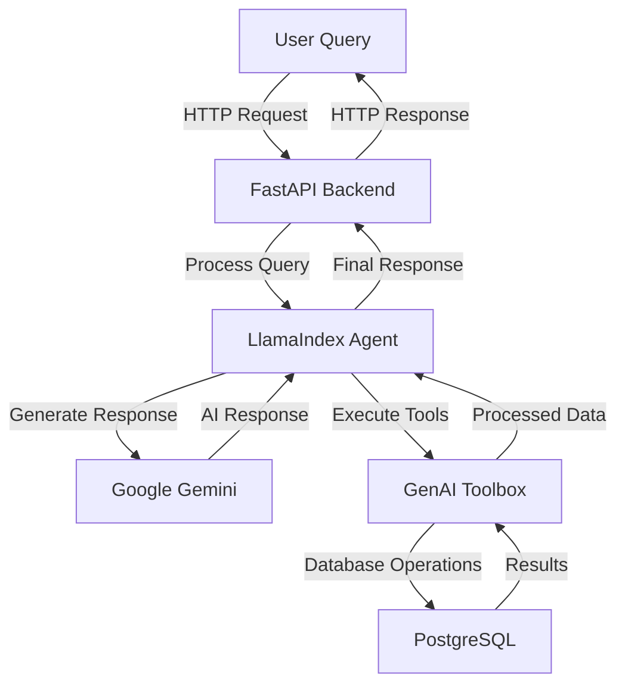

# DVD Rental Assistant with Google Gemini + GenAI Toolbox + LlamaIndex

A modern DVD rental assistant powered by Google's Gemini AI, built with FastAPI and Streamlit. This project demonstrates the integration of Google's latest AI technology with GenAI Toolbox and LlamaIndex to create an intelligent DVD rental management system.

## 🌟 Key Features

- 🤖 Natural language understanding for DVD rental queries
- 📊 Real-time database operations through GenAI Toolbox
- 🔄 Intelligent conversation flow with LlamaIndex
- 🎯 Context-aware responses with Google Gemini
- 📝 Structured data presentation with emojis
- 🔍 Smart search capabilities across film database

## 🛠️ Technical Stack

### Core Technologies
1. **AI/ML Layer**:
   - Google Gemini 1.5 Pro - Advanced language model for natural understanding and context-aware responses
   - LlamaIndex AgentWorkflow - Manages conversation flow and tool execution
   - GenAI Toolbox - Handles database operations and tool management
   - Natural Language Processing - Powers intelligent query understanding and response generation

2. **Backend Layer**:
   - FastAPI (Python 3.9+) - High-performance async web framework
   - PostgreSQL Database - Robust relational database for data storage
   - GenAI Toolbox Server - Central hub for database operations
   - WebSocket Support - Real-time communication capabilities

3. **Frontend Layer**:
   - Streamlit - Modern, responsive web interface
   - Real-time chat interface - Interactive user communication
   - Responsive UI components - Mobile-friendly design
   - Interactive visualizations - Dynamic data presentation

4. **Infrastructure**:
   - Environment-based configuration - Using .env for API keys and settings
   - Logging system - Python logging for request tracking and error handling
   - Error handling - FastAPI error management and retry mechanisms

### Technology Details

#### Google Gemini Integration
- **Model**: Gemini 1.5 Pro
- **Features**:
  - Natural language understanding
  - Context-aware responses
  - Multi-turn conversation support
  - Structured data generation
- **Usage**: Powers the core intelligence of the DVD rental assistant

#### GenAI Toolbox
- **Purpose**: Database operations and tool management
- **Features**:
  - SQL query generation
  - Database connection management
  - Result processing
  - Error handling
- **Integration**: Seamless connection between AI and database

#### LlamaIndex AgentWorkflow
- **Role**: Conversation and tool execution management
- **Features**:
  - Tool selection logic
  - Context maintenance
  - Response formatting
  - Error recovery
- **Benefits**: Structured conversation flow and reliable tool execution

### Architecture Overview



### Tool Execution Flow

1. **System Architecture**:
   ```mermaid
   graph TD
       A[Frontend - Streamlit] -->|HTTP/REST| B[Backend - FastAPI]
       B -->|API Calls| C[GenAI Toolbox]
       C -->|Database Operations| D[PostgreSQL]
       B -->|LLM Integration| E[Google Gemini]
       B -->|Agent Management| F[LlamaIndex]
       F -->|Tool Execution| C
   ```

2. **Request Flow**:
   ```mermaid
   sequenceDiagram
       participant User
       participant Frontend
       participant Backend
       participant Agent
       participant Toolbox
       participant Database
       
       User->>Frontend: Submit query
       Frontend->>Backend: POST /chat
       Backend->>Agent: Process query
       Agent->>Toolbox: Select appropriate tool
       Toolbox->>Database: Execute database operation
       Database-->>Toolbox: Return results
       Toolbox-->>Agent: Process results
       Agent-->>Backend: Generate response
       Backend-->>Frontend: Return response
       Frontend-->>User: Display results
   ```

3. **Tool Selection Logic**:
   - Natural language understanding of user intent
   - Context-aware tool selection
   - Parameter extraction from user queries
   - Error handling and fallback options

4. **Response Generation**:
   - Structured data formatting
   - Emoji enhancement for readability
   - Follow-up question generation
   - Context maintenance

### Error Handling and Recovery

1. **Basic Error Handling**:
   - FastAPI HTTP exceptions for API errors
   - Basic logging for request tracking
   - Simple retry mechanism for toolbox operations
   - Basic rate limiting with sleep

2. **Toolbox Integration**:
   - Connection verification
   - Basic error responses
   - Tool execution error handling

3. **User Context Management**:
   - Context reset functionality
   - Basic user session handling
   - Simple error messages

## Getting Started

### Prerequisites
- Python 3.9+
- PostgreSQL with Pagila database
- Google API key for Gemini
- GenAI Toolbox access

### Installation
1. Clone the repository:
   ```bash
   git clone https://github.com/yourusername/dvd-rental-assistant.git
   cd dvd-rental-assistant
   ```

2. Install dependencies:
   ```bash
   pip install -r requirements.txt
   ```

3. Set up environment variables:
   ```bash
   cp .env.example .env
   # Edit .env with your credentials
   ```

4. Initialize the database:
   ```bash
   # Follow database setup instructions
   ```

### Running the Application
1. Start the backend server:
   ```bash
   uvicorn backend:app --reload
   ```

2. Start the frontend:
   ```bash
   streamlit run frontend.py
   ```

3. Access the application:
   ```
   http://localhost:8000
   ```

## 📝 API Documentation

### Endpoints

1. **Health Check**
   ```http
   GET /health
   ```
   - Verifies system health and toolbox connection
   - Returns: `{"status": "healthy", "toolbox_connected": true}`

2. **Chat Endpoint**
   ```http
   POST /chat
   Content-Type: application/json
   
   {
     "message": "Show me action movies from 2005",
     "user_id": "user123"
   }
   ```
   - Processes user queries
   - Maintains conversation context
   - Returns AI-generated responses

3. **Reset Context**
   ```http
   POST /reset-context/{user_id}
   ```
   - Clears conversation history for a user
   - Returns: `{"status": "success", "message": "Context reset"}`

### Error Responses
```json
{
  "error": "Error message",
  "details": "Detailed error information",
  "status_code": 400
}
```

## 📄 License
This project is licensed under the MIT License - see the LICENSE file for details.

## 👨‍💻 Author
Arjun Prabhulal - [Medium](https://medium.com/@arjunprabhulal)


