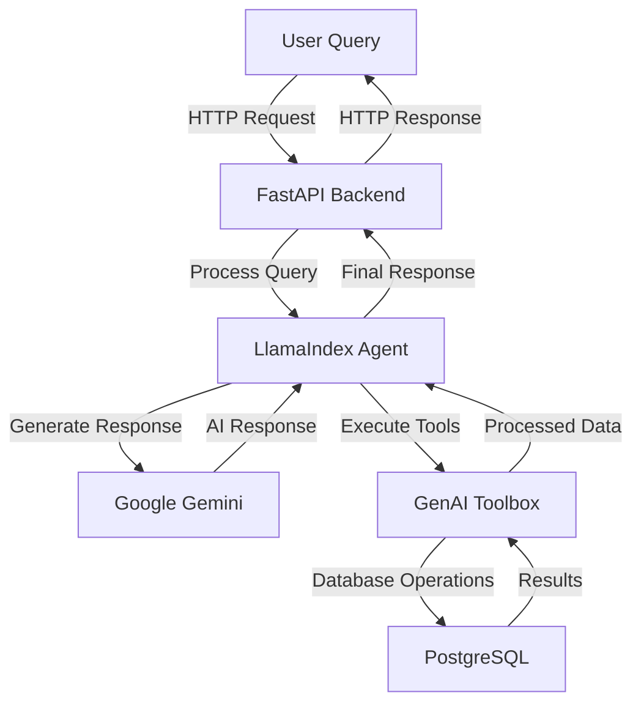
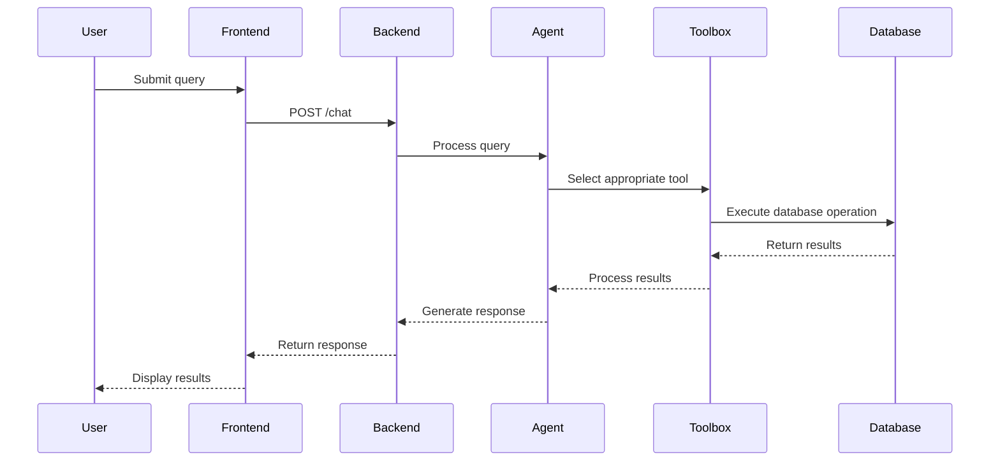

# DVD Rental Assistant with [Google Gemini](https://ai.google.dev/gemini-api) + [GenAI Toolbox](https://github.com/google/generative-ai-toolbox) + [LlamaIndex](https://docs.llamaindex.ai/en/stable/api_reference/agent/workflow/#llama_index.core.agent.workflow.AgentWorkflow)

[](https://www.python.org/downloads/)
[](https://fastapi.tiangolo.com/)
[](https://streamlit.io/)
[](https://www.postgresql.org/)


## 📚 Table of Contents

- [Features](#features)
- [Architecture](#architecture)
  - [Core Technologies](#core-technologies)
  - [Technology Stack Details](#technology-stack-details)
  - [System Architecture](#system-architecture)
  - [Request Flow](#request-flow)
- [Implementation Details](#implementation-details)
  - [GenAI Toolbox Integration](#genai-toolbox-integration)
  - [LlamaIndex AgentWorkflow Setup](#llamaindex-agentworkflow-setup)
- [Getting Started](#getting-started)
  - [Prerequisites](#prerequisites)
  - [Installation Steps](#installation-steps)
- [Project Structure](#project-structure)
- [API Documentation](#api-documentation)
  - [Endpoints](#endpoints)
  - [Example Requests](#example-requests)
  - [Error Response Format](#error-response-format)
- [Author](#author)
- [License](#license)


## Features

- Natural language understanding for DVD rental queries
- Real-time database operations through GenAI Toolbox
- Intelligent conversation flow with LlamaIndex
- Context-aware responses with Google Gemini
- Structured data presentation with emojis
- Smart search capabilities across film database

## 🏗️ Architecture

### Core Technologies

| Layer | Technologies | Description |
|-------|--------------|-------------|
| **AI/ML** | • Google Gemini 1.5 Pro<br>• LlamaIndex AgentWorkflow<br>• GenAI Toolbox<br>• Natural Language Processing | Advanced language model for natural understanding and context-aware responses |
| **Backend** | • FastAPI (Python 3.9+)<br>• PostgreSQL Database<br>• GenAI Toolbox Server<br>• WebSocket Support | High-performance async web framework with robust data storage |
| **Frontend** | • Streamlit<br>• Real-time chat interface<br>• Responsive UI components<br>• Interactive visualizations | Modern, responsive web interface for user interaction |

### Technology Stack Details

| Technology | Purpose | Key Features | Usage |
|------------|---------|--------------|--------|
| **Google Gemini** | Core AI Engine | • Natural language understanding<br>• Context-aware responses<br>• Multi-turn conversation support<br>• Structured data generation | Powers the core intelligence of the DVD rental assistant |
| **GenAI Toolbox** | Database Operations | • SQL query generation<br>• Database connection management<br>• Result processing<br>• Error handling | Seamless connection between AI and database |
| **LlamaIndex AgentWorkflow** | Conversation Management | • Tool selection logic<br>• Context maintenance<br>• Response formatting<br>• Error recovery | Structured conversation flow and reliable tool execution |
| **FastAPI Backend** | API Framework | • Async/await support<br>• Automatic API documentation<br>• Built-in data validation<br>• WebSocket support | Powers the RESTful API endpoints and WebSocket connections |
| **Streamlit UI** | Frontend Interface | • Real-time chat interface<br>• Interactive data visualization<br>• Responsive design<br>• Session state management | Modern web interface for user interaction |
| **Pydantic Models** | Data Validation | • Type checking<br>• Data validation<br>• JSON serialization<br>• Environment variable management | Request/response models and configuration management |

### System Architecture



### Request Flow



## 🛠️ Implementation Details

### GenAI Toolbox Integration

```python
from toolbox_llamaindex import ToolboxClient

# Initialize toolbox client
client = ToolboxClient("http://127.0.0.1:5000")

# Load database tools
tools = client.load_toolset()
```

### LlamaIndex AgentWorkflow Setup

```python
from llama_index.core.agent import AgentWorkflow
from llama_index.core.tools import ToolMetadata
from llama_index.llms import GoogleGenAI

# Initialize the agent with tools and LLM
agent = AgentWorkflow.from_tools_or_functions(
    tools,
    llm=GoogleGenAI(
        model="gemini-1.5-pro",
        vertexai_config={
            "project": "vertex-ai-experminent",
            "location": "us-central1"
        }
    ),
    system_prompt=DVD_RENTAL_PROMPT
)
```

## 🚀 Getting Started

### Prerequisites
- Python 3.9+
- PostgreSQL with Pagila database
- Google API key for Gemini
- GenAI Toolbox access

### Installation Steps

1. **Clone Repository**
   ```bash
   git clone https://github.com/arjunprabhulal/gemini-toolbox-dvd-rental-assistant.git
   cd gemini-toolbox-dvd-rental-assistant
   ```

2. **Environment Setup**
   ```bash
   python -m venv venv
   source venv/bin/activate  # On Windows: venv\Scripts\activate
   pip install -r requirements.txt
   ```

3. **Configuration**
   ```bash
   cp .env.example .env
   # Edit .env with your credentials:
   # GOOGLE_API_KEY=your_gemini_api_key
   # TOOLBOX_URL=http://127.0.0.1:5000
   ```

4. **GenAI Toolbox Setup**
   ```bash
   curl -L https://github.com/google/generative-ai-toolbox/releases/latest/download/toolbox-darwin-amd64 -o toolbox
   chmod +x toolbox
   ./toolbox --version
   ```

5. **Database Setup**
   ```bash
   # Create and load database
   psql -U postgres
   CREATE DATABASE toolbox_db;
   \c toolbox_db
   \q

   # Load Pagila database
   mkdir -p database/pagila
   cd database/pagila
   curl -O https://raw.githubusercontent.com/devrimgunduz/pagila/master/pagila-schema.sql
   curl -O https://raw.githubusercontent.com/devrimgunduz/pagila/master/pagila-data.sql

   psql -U postgres -d toolbox_db -f pagila-schema.sql
   psql -U postgres -d toolbox_db -f pagila-data.sql
   ```

6. **Start Services**
   ```bash
   # Start GenAI Toolbox
   ./toolbox --tools_file "dvdrental_tools.yaml"

   # Start Backend
   uvicorn backend:app --reload

   # Start Frontend
   streamlit run streamlit_app.py
   ```

7. **Access Application**
   ```
   Backend: http://localhost:8000
   Frontend: http://localhost:8501
   ```

## 📁 Project Structure
```
gemini-toolbox-dvd-rental-assistant/
├── database/
│   └── pagila/
│       ├── pagila-schema.sql    # Database schema
│       ├── pagila-data.sql      # Initial data
│       └── pagila-insert-data.sql # Additional data
├── backend.py                   # FastAPI backend
├── streamlit_app.py            # Streamlit frontend
├── prompts.py                  # System prompts
├── dvdrental_tools.yaml        # Database configuration
├── requirements.txt            # Dependencies
└── .env                        # Environment variables
```

## 📚 API Documentation

### Endpoints

| Endpoint | Method | Description |
|----------|---------|-------------|
| `/health` | GET | System health check |
| `/chat` | POST | Process user queries |
| `/reset-context/{user_id}` | POST | Reset user conversation context |

### Example Requests

```http
# Health Check
GET /health

# Chat Query
POST /chat
Content-Type: application/json
{
  "message": "Show me action movies from 2005",
  "user_id": "user123"
}

# Reset Context
POST /reset-context/user123
```

### Error Response Format
```json
{
  "error": "Error message",
  "details": "Detailed error information",
  "status_code": 400
}
```
## 📄 License

This project is licensed under the MIT License. See the [LICENSE](./LICENSE) file for details.

## 👨‍💻 Author
For more articles on AI/ML and Generative AI, follow me on [Medium](https://medium.com/@arjun-prabhulal)


