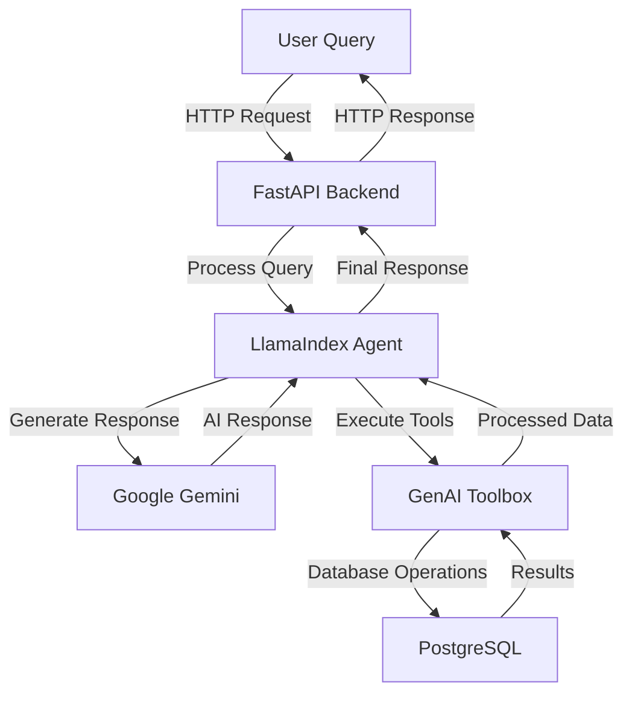

# DVD Rental Assistant with Google Gemini + GenAI Toolbox + LlamaIndex

A modern DVD rental assistant powered by Google's Gemini AI, built with FastAPI and Streamlit. This project demonstrates the integration of Google's latest AI technology with GenAI Toolbox and LlamaIndex to create an intelligent DVD rental management system.

## 🌟 Key Features

- 🤖 Natural language understanding for DVD rental queries
- 📊 Real-time database operations through GenAI Toolbox
- 🔄 Intelligent conversation flow with LlamaIndex
- 🎯 Context-aware responses with Google Gemini
- 📝 Structured data presentation with emojis
- 🔍 Smart search capabilities across film database

## 🛠️ Technical Stack

### Core Technologies
1. **AI/ML Layer**:
   - Google Gemini 1.5 Pro - Advanced language model for natural understanding and context-aware responses
   - LlamaIndex AgentWorkflow - Manages conversation flow and tool execution
   - GenAI Toolbox - Handles database operations and tool management
   - Natural Language Processing - Powers intelligent query understanding and response generation

2. **Backend Layer**:
   - FastAPI (Python 3.9+) - High-performance async web framework
   - PostgreSQL Database - Robust relational database for data storage
   - GenAI Toolbox Server - Central hub for database operations
   - WebSocket Support - Real-time communication capabilities

3. **Frontend Layer**:
   - Streamlit - Modern, responsive web interface
   - Real-time chat interface - Interactive user communication
   - Responsive UI components - Mobile-friendly design
   - Interactive visualizations - Dynamic data presentation

4. **Infrastructure**:
   - Environment-based configuration - Using .env for API keys and settings
   - Logging system - Python logging for request tracking and error handling
   - Error handling - FastAPI error management and retry mechanisms

### Technology Details

#### 1. Google Gemini Integration
- **Model**: Gemini 1.5 Pro
- **Features**:
  - Natural language understanding
  - Context-aware responses
  - Multi-turn conversation support
  - Structured data generation
- **Usage**: Powers the core intelligence of the DVD rental assistant

#### 2. GenAI Toolbox
- **Purpose**: Database operations and tool management
- **Features**:
  - SQL query generation
  - Database connection management
  - Result processing
  - Error handling
- **Integration**: Seamless connection between AI and database

#### 3. LlamaIndex AgentWorkflow
- **Role**: Conversation and tool execution management
- **Features**:
  - Tool selection logic
  - Context maintenance
  - Response formatting
  - Error recovery
- **Benefits**: Structured conversation flow and reliable tool execution

#### 4. FastAPI Backend
- **Framework**: Modern, fast web framework for building APIs
- **Features**:
  - Async/await support for high performance
  - Automatic API documentation with Swagger UI
  - Built-in data validation
  - WebSocket support for real-time communication
- **Usage**: Powers the RESTful API endpoints and WebSocket connections

#### 5. Streamlit UI
- **Framework**: Modern web interface for data applications
- **Features**:
  - Real-time chat interface
  - Interactive data visualization
  - Responsive design
  - Session state management
- **Components**:
  - Chat message history
  - User input forms
  - Loading indicators
  - Error message displays

#### 6. Pydantic Models
- **Purpose**: Data validation and settings management
- **Features**:
  - Type checking
  - Data validation
  - JSON serialization
  - Environment variable management
- **Usage**:
  - Request/response models
  - Configuration management
  - Database schema validation

### GenAI Toolbox Implementation

The project leverages Google's GenAI Toolbox for efficient database operations:

1. **Core Features**:
   ```python
   from toolbox_llamaindex import ToolboxClient
   
   # Initialize toolbox client
   client = ToolboxClient("http://127.0.0.1:5000")
   
   # Load database tools
   tools = client.load_toolset()
   ```

2. **Key Benefits**:
   - **Simplified Development**: Integrate database tools in less than 10 lines of code
   - **Better Performance**: Built-in connection pooling and authentication
   - **Enhanced Security**: Integrated auth for secure data access
   - **End-to-end Observability**: Built-in metrics and tracing with OpenTelemetry

3. **Tool Configuration**:
   ```yaml
   # dvdrental_tools.yaml
   tools:
     - name: search_films_by_title
       description: Search films by title
       parameters:
         - name: title
           type: string
           description: Film title to search
   ```

4. **Integration Features**:
   - Centralized tool management
   - Easy tool sharing between agents
   - Version control for tools
   - Built-in error handling
   - Connection pooling
   - Authentication management

5. **Server Setup**:
   ```bash
   # Start toolbox server
   ./toolbox --tools_file "dvdrental_tools.yaml"
   ```

### LlamaIndex AgentWorkflow Implementation

The project uses LlamaIndex's AgentWorkflow to create an intelligent conversation flow:

1. **Core Components**:
   ```python
   from llama_index.core.agent import AgentWorkflow
   from llama_index.core.tools import ToolMetadata
   from llama_index.llms import GoogleGenAI
   
   # Initialize the agent with tools and LLM
   agent = AgentWorkflow.from_tools_or_functions(
       tools,
       llm=GoogleGenAI(
           model="gemini-1.5-pro",
           vertexai_config={
               "project": "vertex-ai-experminent",
               "location": "us-central1"
           }
       ),
       system_prompt=DVD_RENTAL_PROMPT
   )
   ```

2. **Key Features**:
   - **Tool Selection**: Automatically selects appropriate tools based on user queries
   - **Context Management**: Maintains conversation history and context
   - **Event Handling**: Manages tool calls, results, and responses
   - **Streaming Support**: Real-time response generation
   - **Error Recovery**: Built-in error handling and retry mechanisms

3. **Workflow Events**:
   - `AgentInput`: Processes user queries
   - `AgentStream`: Handles streaming responses
   - `AgentOutput`: Manages final responses
   - `ToolCall`: Executes database operations
   - `ToolCallResult`: Processes tool execution results

4. **Integration Benefits**:
   - Seamless connection between Gemini and GenAI Toolbox
   - Structured conversation flow
   - Reliable tool execution
   - Context-aware responses
   - Error handling and recovery

### Architecture Overview



### Tool Execution Flow

1. **System Architecture**:
   ```mermaid
   graph TD
       A[Frontend - Streamlit] -->|HTTP/REST| B[Backend - FastAPI]
       B -->|API Calls| C[GenAI Toolbox]
       C -->|Database Operations| D[PostgreSQL]
       B -->|LLM Integration| E[Google Gemini]
       B -->|Agent Management| F[LlamaIndex]
       F -->|Tool Execution| C
   ```

2. **Request Flow**:
   ```mermaid
   sequenceDiagram
       participant User
       participant Frontend
       participant Backend
       participant Agent
       participant Toolbox
       participant Database
       
       User->>Frontend: Submit query
       Frontend->>Backend: POST /chat
       Backend->>Agent: Process query
       Agent->>Toolbox: Select appropriate tool
       Toolbox->>Database: Execute database operation
       Database-->>Toolbox: Return results
       Toolbox-->>Agent: Process results
       Agent-->>Backend: Generate response
       Backend-->>Frontend: Return response
       Frontend-->>User: Display results
   ```

3. **Tool Selection Logic**:
   - Natural language understanding of user intent
   - Context-aware tool selection
   - Parameter extraction from user queries
   - Error handling and fallback options

4. **Response Generation**:
   - Structured data formatting
   - Emoji enhancement for readability
   - Follow-up question generation
   - Context maintenance

## Getting Started

### Prerequisites
- Python 3.9+
- PostgreSQL with Pagila database
- Google API key for Gemini
- GenAI Toolbox access

### Installation

1. **Clone the Repository**:
   ```bash
   git clone https://github.com/arjunprabhulal/gemini-toolbox-dvd-rental-assistant.git
   cd gemini-toolbox-dvd-rental-assistant
   ```

2. **Set Up Virtual Environment**:
   ```bash
   python -m venv venv
   source venv/bin/activate  # On Windows: venv\Scripts\activate
   ```

3. **Install Dependencies**:
   ```bash
   pip install -r requirements.txt
   ```

4. **Configure Environment Variables**:
   ```bash
   cp .env.example .env
   # Edit .env with your credentials:
   # GOOGLE_API_KEY=your_gemini_api_key
   # TOOLBOX_URL=http://127.0.0.1:5000
   ```

5. **Download and Setup GenAI Toolbox**:
   ```bash
   # Download the toolbox binary
   curl -L https://github.com/google/generative-ai-toolbox/releases/latest/download/toolbox-darwin-amd64 -o toolbox
   chmod +x toolbox

   # Verify toolbox installation
   ./toolbox --version
   ```

6. **Database Setup**:
   ```bash
   # Create PostgreSQL database
   psql -U postgres
   CREATE DATABASE toolbox_db;
   \c toolbox_db
   \q

   # Download and load Pagila database
   mkdir -p database/pagila
   cd database/pagila
   curl -O https://raw.githubusercontent.com/devrimgunduz/pagila/master/pagila-schema.sql
   curl -O https://raw.githubusercontent.com/devrimgunduz/pagila/master/pagila-data.sql

   # Load schema and data
   psql -U postgres -d toolbox_db -f pagila-schema.sql
   psql -U postgres -d toolbox_db -f pagila-data.sql
   ```

   > **Note**: This project uses the [Pagila](https://github.com/devrimgunduz/pagila) sample database, which is a port of the Sakila example database for PostgreSQL. It provides a standard schema for DVD rental operations with tables for films, customers, rentals, and more. The database includes sample data that helps demonstrate various PostgreSQL features including partitioning, full-text search, and JSONB support.

7. **Start GenAI Toolbox**:
   ```bash
   ./toolbox --tools_file "dvdrental_tools.yaml"
   ```

8. **Start Backend Server**:
   ```bash
   uvicorn backend:app --reload
   ```

9. **Start Frontend**:
   ```bash
   streamlit run streamlit_app.py
   ```

10. **Access the Application**:
    ```
    Backend: http://localhost:8000
    Frontend: http://localhost:8501
    ```

### Project Structure
```
gemini-toolbox-dvd-rental-assistant/
├── database/
│   └── pagila/
│       ├── pagila-schema.sql    # Database schema
│       ├── pagila-data.sql      # Initial data
│       └── pagila-insert-data.sql # Additional data
├── backend.py                   # FastAPI backend
├── streamlit_app.py            # Streamlit frontend
├── prompts.py                  # System prompts
├── dvdrental_tools.yaml        # Database configuration
├── requirements.txt            # Dependencies
└── .env                        # Environment variables
```

## 📝 API Documentation

### Endpoints

1. **Health Check**
   ```http
   GET /health
   ```
   - Verifies system health and toolbox connection
   - Returns: `{"status": "healthy", "toolbox_connected": true}`

2. **Chat Endpoint**
   ```http
   POST /chat
   Content-Type: application/json
   
   {
     "message": "Show me action movies from 2005",
     "user_id": "user123"
   }
   ```
   - Processes user queries
   - Maintains conversation context
   - Returns AI-generated responses

3. **Reset Context**
   ```http
   POST /reset-context/{user_id}
   ```
   - Clears conversation history for a user
   - Returns: `{"status": "success", "message": "Context reset"}`

### Error Responses
```json
{
  "error": "Error message",
  "details": "Detailed error information",
  "status_code": 400
}
```

## Author
For more articles on AI/ML and Generative AI, follow me on Medium: https://medium.com/@arjun-prabhulal


