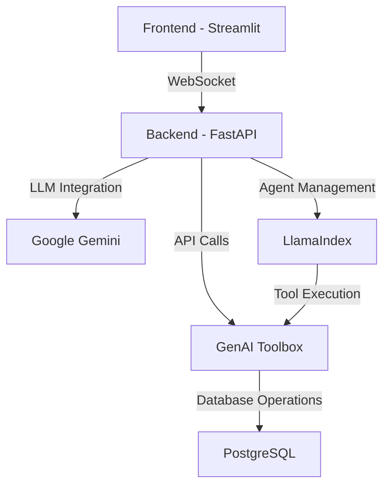

# DVD Rental Assistant with Google Gemini + GenAI Toolbox + LlamaIndex

A modern DVD rental assistant powered by Google's Gemini AI, built with FastAPI and Streamlit. This project demonstrates the integration of Google's latest AI technology with GenAI Toolbox and LlamaIndex to create an intelligent DVD rental management system.

## 🛠️ Technical Stack

### Core Technologies
1. **AI/ML Layer**:
   - Google Gemini 1.5 Pro
   - LlamaIndex AgentWorkflow
   - GenAI Toolbox
   - Natural Language Processing

2. **Backend Layer**:
   - FastAPI (Python 3.9+)
   - PostgreSQL Database
   - GenAI Toolbox Server
   - WebSocket Support

3. **Frontend Layer**:
   - Streamlit
   - Real-time chat interface
   - Responsive UI components
   - Interactive visualizations

4. **Infrastructure**:
   - Docker support
   - OpenTelemetry monitoring
   - Environment-based configuration
   - CI/CD pipeline

### Architecture Overview



## 🔍 Application Details

### Core Application Features

1. **Intelligent Chat Interface**:
   - Natural language understanding for complex queries
   - Context-aware responses with conversation history
   - Real-time streaming of AI responses
   - Multi-turn conversation support
   - Emoji-enhanced responses for better readability

2. **Film Management System**:
   - Comprehensive film database with 1000+ titles
   - Advanced search capabilities:
     - Title-based search
     - Genre filtering
     - Year-based filtering
     - Rating-based filtering
   - Detailed film information:
     - Cast and crew details
     - Plot summaries
     - Rental rates
     - Availability status

3. **Customer Service Features**:
   - Customer profile management
   - Rental history tracking
   - Payment processing
   - Loyalty program integration
   - Personalized recommendations

4. **Rental Management**:
   - Real-time inventory checking
   - Automated rental processing
   - Return date management
   - Late fee calculation
   - Rental history tracking

### Tool Integration Details

1. **GenAI Toolbox Integration**:
   ```python
   # Toolbox Configuration
   tools = ToolboxClient("http://127.0.0.1:5000").load_toolset()
   
   # Available Tools
   - search_films_by_title: Search films by title
   - get_film_availability: Check film availability
   - get_film_details: Get detailed film information
   - get_customer_rentals: View customer rental history
   - process_rental: Handle rental transactions
   ```

2. **LlamaIndex Agent Configuration**:
   ```python
   # Agent Setup
   agent = AgentWorkflow.from_tools_or_functions(
       tools,
       llm=GoogleGenAI(
           model="gemini-1.5-pro",
           vertexai_config={
               "project": "vertex-ai-experminent",
               "location": "us-central1"
           }
       ),
       system_prompt=DVD_RENTAL_PROMPT
   )
   ```

3. **Database Tools**:
   ```yaml
   # dvdrental_tools.yaml
   tools:
     - name: search_films_by_title
       description: Search films by title
       parameters:
         - name: title
           type: string
           description: Film title to search
     
     - name: get_film_availability
       description: Check film availability
       parameters:
         - name: film_id
           type: integer
           description: ID of the film to check
   ```

4. **API Endpoints**:
   ```python
   # FastAPI Routes
   @app.get("/health")
   async def health_check():
       """Health check endpoint"""
       try:
           client = ToolboxClient("http://127.0.0.1:5000")
           tools = client.load_toolset()
           return {"status": "healthy", "toolbox_connected": True}
       except Exception as e:
           return {"status": "unhealthy", "toolbox_connected": False, "error": str(e)}

   @app.post("/chat", response_model=ChatResponse)
   async def chat_endpoint(request: ChatRequest):
       """Handle chat messages with user context"""
       user_id = request.user_id
       message = request.message
       
       logger.info(f"Received message from user {user_id}: {message}")
       
       # Create or retrieve user context
       if user_id not in user_contexts:
           agent = get_agent()
           user_contexts[user_id] = {"agent": agent, "context": Context(agent)}
           logger.info(f"Created new context for user {user_id}")
       
       agent = user_contexts[user_id]["agent"]
       ctx = user_contexts[user_id]["context"]
       
       try:
           await asyncio.sleep(1)  # Rate limit prevention
           response = await run_with_retry(agent, message, ctx)
           return ChatResponse(response=str(response))
       except Exception as e:
           logger.error(f"Error processing request from user {user_id}: {str(e)}")
           raise HTTPException(status_code=500, detail=str(e))

   @app.delete("/reset-context/{user_id}")
   async def reset_context(user_id: str):
       """Reset user conversation context"""
       if user_id in user_contexts:
           del user_contexts[user_id]
           logger.info(f"Reset context for user {user_id}")
           return {"status": "success", "message": f"Context for user {user_id} has been reset"}
       raise HTTPException(status_code=404, detail=f"No context found for user {user_id}")
   ```

### API Documentation

1. **REST Endpoints**:
   - `GET /health`: Health check endpoint
     - Response: `{"status": "healthy", "toolbox_connected": true}`
   - `POST /chat`: Process chat messages
     - Request Body: `{"message": "string", "user_id": "string"}`
     - Response: `{"response": "string"}`
   - `DELETE /reset-context/{user_id}`: Reset user context
     - Response: `{"status": "success", "message": "Context reset message"}`

2. **Features**:
   - User context management
   - Rate limiting with exponential backoff
   - Comprehensive error handling
   - Logging system
   - Toolbox connection verification

3. **Error Handling**:
   - HTTP 500 for server errors
   - HTTP 404 for not found
   - Rate limit handling with retries
   - Detailed error logging
   - Clean error messages

### Tool Execution Flow

1. **System Architecture**:
   ```mermaid
   graph TD
       A[Frontend - Streamlit] -->|HTTP/REST| B[Backend - FastAPI]
       B -->|API Calls| C[GenAI Toolbox]
       C -->|Database Operations| D[PostgreSQL]
       B -->|LLM Integration| E[Google Gemini]
       B -->|Agent Management| F[LlamaIndex]
       F -->|Tool Execution| C
   ```

2. **Request Flow**:
   ```mermaid
   sequenceDiagram
       participant User
       participant Frontend
       participant Backend
       participant Agent
       participant Toolbox
       participant Database
       
       User->>Frontend: Submit query
       Frontend->>Backend: POST /chat
       Backend->>Agent: Process query
       Agent->>Toolbox: Select appropriate tool
       Toolbox->>Database: Execute database operation
       Database-->>Toolbox: Return results
       Toolbox-->>Agent: Process results
       Agent-->>Backend: Generate response
       Backend-->>Frontend: Return response
       Frontend-->>User: Display results
   ```

3. **Tool Selection Logic**:
   - Natural language understanding of user intent
   - Context-aware tool selection
   - Parameter extraction from user queries
   - Error handling and fallback options

4. **Response Generation**:
   - Structured data formatting
   - Emoji enhancement for readability
   - Follow-up question generation
   - Context maintenance

### Error Handling and Recovery

1. **Database Errors**:
   - Connection failure recovery
   - Query timeout handling
   - Transaction rollback
   - Data validation

2. **AI Processing Errors**:
   - Model timeout handling
   - Response validation
   - Fallback responses
   - Context recovery

3. **API Errors**:
   - Rate limiting
   - Input validation
   - Authentication errors
   - Network issues

## 🚀 Getting Started

### Prerequisites
- Python 3.9+
- PostgreSQL
- Google Cloud Platform account
- GenAI Toolbox installed

### Installation

1. **Clone the Repository**:
   ```bash
   git clone https://github.com/arjunprabhulal/gemini-toolbox-dvd-rental-assistant.git
   cd gemini-toolbox-dvd-rental-assistant
   ```

2. **Set Up Virtual Environment**:
   ```bash
   python -m venv venv
   source venv/bin/activate  # On Windows: venv\Scripts\activate
   ```

3. **Install Dependencies**:
   ```bash
   pip install -r requirements.txt
   ```

4. **Configure Environment Variables**:
   ```bash
   cp .env.example .env
   # Edit .env with your credentials
   ```

### Database Setup

1. **Download Pagila Database**:
   ```bash
   mkdir -p database/pagila
   cd database/pagila
   curl -O https://raw.githubusercontent.com/devrimgunduz/pagila/master/pagila-schema.sql
   curl -O https://raw.githubusercontent.com/devrimgunduz/pagila/master/pagila-data.sql
   curl -O https://raw.githubusercontent.com/devrimgunduz/pagila/master/pagila-insert-data.sql
   ```

2. **Create PostgreSQL Database**:
   ```bash
   psql -U postgres
   CREATE DATABASE toolbox_db;
   \c toolbox_db
   \q
   ```

3. **Load Pagila Schema and Data**:
   ```bash
   psql -U postgres -d toolbox_db -f database/pagila/pagila-schema.sql
   psql -U postgres -d toolbox_db -f database/pagila/pagila-data.sql
   psql -U postgres -d toolbox_db -f database/pagila/pagila-insert-data.sql
   ```

### Starting the Application

1. **Start GenAI Toolbox**:
   ```bash
   ./toolbox --tools_file "dvdrental_tools.yaml"
   ```

2. **Start Backend**:
   ```bash
   python backend.py
   ```

3. **Start Frontend**:
   ```bash
   streamlit run streamlit_app.py
   ```

## 📝 Project Structure

```
google-genai-toolbox/
├── database/
│   └── pagila/
│       ├── pagila-schema.sql    # Database schema
│       ├── pagila-data.sql      # Initial data
│       └── pagila-insert-data.sql # Additional data
├── backend.py                   # FastAPI backend
├── streamlit_app.py            # Streamlit frontend
├── prompts.py                  # System prompts
├── dvdrental_tools.yaml        # Database configuration
├── requirements.txt            # Dependencies
└── .env                        # Environment variables
```

## 🔧 Technical Implementation

### 1. AI Integration
- **Google Gemini**: Powers natural language understanding
- **LlamaIndex**: Manages conversation flow and tool execution
- **GenAI Toolbox**: Handles database operations
- **Custom Prompts**: Optimized for DVD rental domain

### 2. Database Architecture
- **Schema Design**: Optimized for DVD rental operations
- **Query Optimization**: Indexed queries for performance
- **Connection Pooling**: Efficient resource management
- **Transaction Management**: ACID compliance

### 3. API Design
- **RESTful Endpoints**: Clean, intuitive API structure
- **WebSocket Support**: Real-time chat functionality
- **Rate Limiting**: Prevents abuse
- **Error Handling**: Comprehensive error management

### 4. Security Features
- **Authentication**: API key-based security
- **Input Validation**: Sanitized user inputs
- **XSS Protection**: Prevents cross-site scripting
- **Data Encryption**: Secure data transmission

## 📊 Performance Optimization

### 1. Database Optimization
- Indexed queries for faster retrieval
- Connection pooling for resource efficiency
- Query caching for repeated operations
- Batch operations for bulk updates

### 2. AI Processing
- Response streaming for faster feedback
- Context management for coherent conversations
- Tool selection optimization
- Error recovery mechanisms

### 3. Frontend Optimization
- Lazy loading of components
- State management for smooth UX
- Real-time updates via WebSocket
- Responsive design for all devices

## 🔍 Monitoring and Observability

### 1. OpenTelemetry Integration
- Request tracing for debugging
- Performance metrics collection
- Error tracking and reporting
- Usage analytics

### 2. Logging System
- Structured logging for better analysis
- Multiple log levels for different scenarios
- Error tracking with stack traces
- Performance monitoring

### 3. Health Checks
- Database connectivity monitoring
- API availability checks
- AI service status verification
- System resource monitoring

## 🤝 Contributing

1. Fork the repository
2. Create your feature branch (`git checkout -b feature/AmazingFeature`)
3. Commit your changes (`git commit -m 'Add some AmazingFeature'`)
4. Push to the branch (`git push origin feature/AmazingFeature`)
5. Open a Pull Request

## 📝 License

This project is licensed under the MIT License - see the [LICENSE](LICENSE) file for details.

## 🙏 Acknowledgments

- Google Gemini AI Team
- GenAI Toolbox Contributors
- LlamaIndex Community
- FastAPI and Streamlit Teams

## 📞 Support

For support, please open an issue in the GitHub repository or contact the maintainers.
