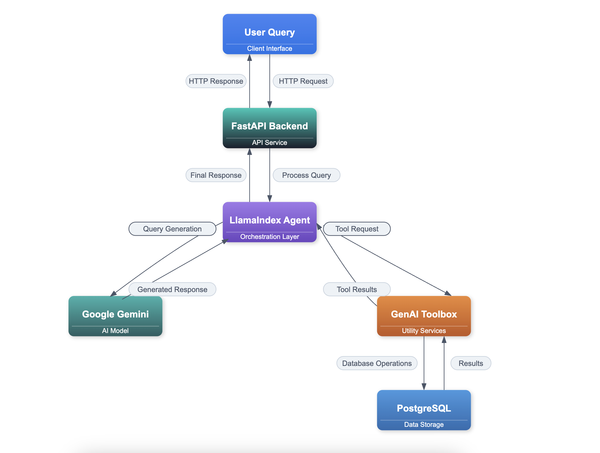

# DVD Rental Assistant with [Google Gemini](https://ai.google.dev/gemini-api) + [GenAI Toolbox](https://googleapis.github.io/genai-toolbox/getting-started/introduction/) + [LlamaIndex](https://docs.llamaindex.ai/en/stable/api_reference/agent/workflow/#llama_index.core.agent.workflow.AgentWorkflow)

[](https://www.python.org/downloads/)
[](https://fastapi.tiangolo.com/)
[](https://streamlit.io/)
[](https://www.postgresql.org/)
[](LICENSE)

A modern DVD rental assistant powered by Google's Gemini AI, built with FastAPI and Streamlit. This project demonstrates the integration of Google's latest AI technology with GenAI Toolbox and LlamaIndex to create an intelligent DVD rental management system.

## 📚 Table of Contents

- [Architecture](#architecture)
  - [Core Technologies](#core-technologies)
  - [Technology Highlights](#technology-highlights)
- [Features](#features)
- [Implementation Details](#implementation-details)
  - [GenAI Toolbox Integration](#genai-toolbox-integration)
  - [LlamaIndex AgentWorkflow Setup](#llamaindex-agentworkflow-setup)
- [Getting Started](#getting-started)
  - [Prerequisites](#prerequisites)
  - [Installation Steps](#installation-steps)
    - [Clone Repository](#1-clone-repository)
    - [Environment Setup](#2-environment-setup)
    - [Configuration](#3-configuration)
    - [GenAI Toolbox Setup](#4-genai-toolbox-setup)
    - [Database Setup](#5-database-setup)
    - [Start Services](#6-start-services)
    - [Access Application](#7-access-application)
- [Project Structure](#project-structure)
- [API Documentation](#api-documentation)
  - [Endpoints](#endpoints)
- [Author](#author)
- [License](#license)

## Architecture

The DVD Rental Assistant follows a streamlined request flow that combines the power of Google Gemini, LlamaIndex, and GenAI Toolbox to process user queries and provide intelligent responses.



### Core Technologies

| Layer        | Technologies                             | Description                                 |
|--------------|------------------------------------------|---------------------------------------------|
| **AI/ML**    | Google Gemini, LlamaIndex, GenAI Toolbox | LLM-driven conversational AI and tool calls |
| **Backend**  | FastAPI, PostgreSQL, WebSocket           | Async API with structured DB integration    |
| **Frontend** | Streamlit, Real-time UI                  | Interactive, responsive user interface      |

### Technology Highlights

- **Google Gemini**  
  Powers conversational AI and context-aware interactions.

- **LlamaIndex**  
  Manages conversation flow and tool orchestration.

- **GenAI Toolbox**  
  Handles secure database operations and SQL execution.

- **FastAPI**  
  Provides async API services, automatic documentation, and data validation.

- **Streamlit**  
  Enables real-time, interactive, and intuitive frontend experiences.

- **Pydantic**  
  Ensures data integrity through structured validation and serialization.


## Features

- Natural language understanding for DVD rental queries
- Real-time database operations through GenAI Toolbox
- Intelligent conversation flow with LlamaIndex
- Context-aware responses with Google Gemini
- Structured data presentation with emojis
- Smart search capabilities across film database

## Implementation Details

### GenAI Toolbox Integration

```python
from toolbox_llamaindex import ToolboxClient

# Initialize toolbox client
client = ToolboxClient("http://127.0.0.1:5000")

# Load database tools
tools = client.load_toolset()
```

### LlamaIndex AgentWorkflow Setup

```python
from llama_index.core.agent import AgentWorkflow
from llama_index.core.tools import ToolMetadata
from llama_index.llms import GoogleGenAI

# Initialize the agent with tools and LLM
agent = AgentWorkflow.from_tools_or_functions(
    tools,
    llm=GoogleGenAI(
        model="gemini-1.5-pro",
        vertexai_config={
            "project": "vertex-ai-experminent",
            "location": "us-central1"
        }
    ),
    system_prompt=DVD_RENTAL_PROMPT
)
```

## Getting Started

### Prerequisites
- Python 3.9+
- PostgreSQL with Pagila database
- Google API key for Gemini
- GenAI Toolbox access

### Installation Steps

#### 1. **Clone Repository**
   ```bash
   git clone https://github.com/arjunprabhulal/gemini-toolbox-dvd-rental-assistant.git
   cd gemini-toolbox-dvd-rental-assistant
   ```

#### 2. **Environment Setup**
   ```bash
   python -m venv venv
   source venv/bin/activate  # On Windows: venv\Scripts\activate
   pip install -r requirements.txt
   ```

#### 3. **Configuration**
   ```bash
   cp .env.example .env
   # Edit .env with your credentials:
   # GOOGLE_API_KEY=your_gemini_api_key
   # TOOLBOX_URL=http://127.0.0.1:5000
   ```

#### 4. **GenAI Toolbox Setup**
   ```bash
   curl -L https://github.com/google/generative-ai-toolbox/releases/latest/download/toolbox-darwin-amd64 -o toolbox
   chmod +x toolbox
   ./toolbox --version
   ```

#### 5. **Database Setup**

This project uses the [Pagila](https://github.com/devrimgunduz/pagila) database — an example schema designed for PostgreSQL, inspired by the Sakila schema for MySQL.

**Special thanks to [devrimgunduz/pagila](https://github.com/devrimgunduz/pagila)** for providing the schema and sample data used in this project.

   ```bash
   # Step 1: Create and load database
   psql -U postgres
   CREATE DATABASE toolbox_db;
   \c toolbox_db
   \q

   # Step 2: Download Pagila schema and data
   mkdir -p database/pagila
   cd database/pagila
   curl -O https://raw.githubusercontent.com/devrimgunduz/pagila/master/pagila-schema.sql
   curl -O https://raw.githubusercontent.com/devrimgunduz/pagila/master/pagila-data.sql

   # Step 3: Load Pagila into the toolbox_db
   psql -U postgres -d toolbox_db -f pagila-schema.sql
   psql -U postgres -d toolbox_db -f pagila-data.sql
   ```

#### 6. **Start Services**
   ```bash
   # Start GenAI Toolbox
   ./toolbox --tools_file "dvdrental_tools.yaml"

   # Start Backend
   uvicorn backend:app --reload

   # Start Frontend
   streamlit run streamlit_app.py
   ```

#### 7. **Access Application**
   ```
   Backend: http://localhost:8000
   Frontend: http://localhost:8501
   ```

## Project Structure
```
gemini-toolbox-dvd-rental-assistant/
├── database/
│   └── pagila/
│       ├── pagila-schema.sql    # Database schema
│       ├── pagila-data.sql      # Initial data
│       └── pagila-insert-data.sql # Additional data
├── backend.py                   # FastAPI backend
├── streamlit_app.py            # Streamlit frontend
├── prompts.py                  # System prompts
├── dvdrental_tools.yaml        # Database configuration
├── requirements.txt            # Dependencies
└── .env                        # Environment variables
```

## API Documentation

### Endpoints

| Endpoint | Method | Description |
|----------|---------|-------------|
| `/health` | GET | System health check |
| `/chat` | POST | Process user queries |
| `/reset-context/{user_id}` | POST | Reset user conversation context |

## License

This project is licensed under the MIT License. See the [LICENSE](./LICENSE) file for details.

## Author
For more articles on AI/ML and Generative AI, follow me on medium [Arjun Prabhulal](https://medium.com/@arjun-prabhulal)


